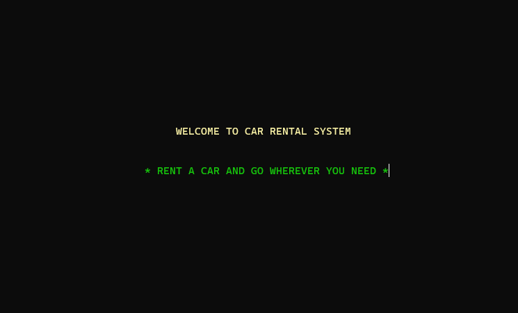
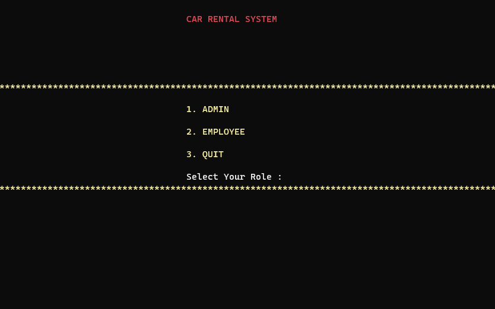
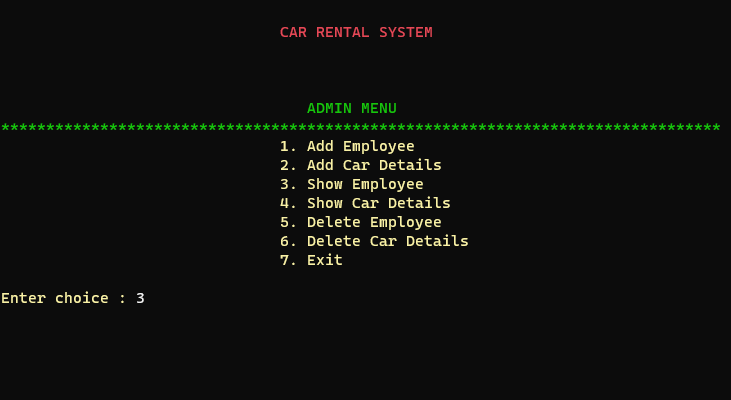
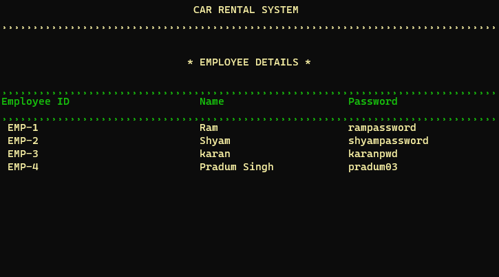
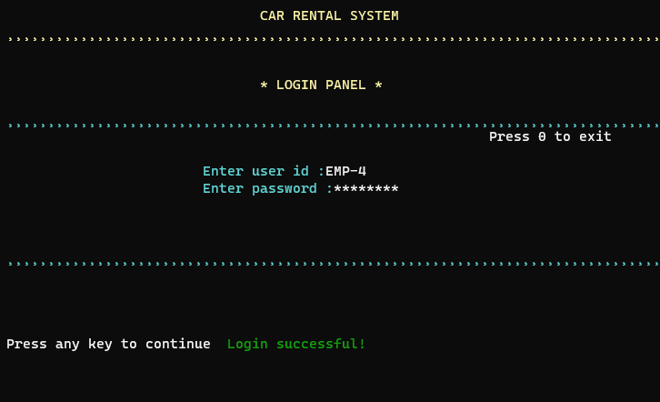
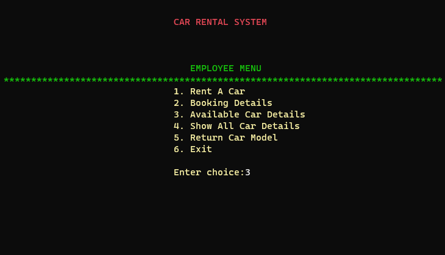
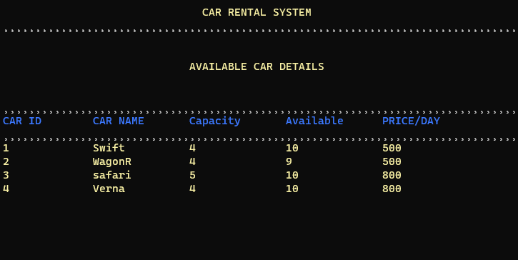

# Car_Rental_Application

* City Car Rental is a project in C, built as a console application. It demonstrates the use of file handling and other advance  concepts of C language .

* The purpose of the project is to build an application which can reduce the manual work of managing the car rental.

* It uses menus for migrating from one screen to another. Also, for all CRUD operations , separate functions are used.

# Screenshots
1. Welcome Screen
   
   

2. Login Options

   

3. Admin Options

   

4. Employee Details

   

5. Employee Login

   

6. Employee Options

   

7. Car Details

      
